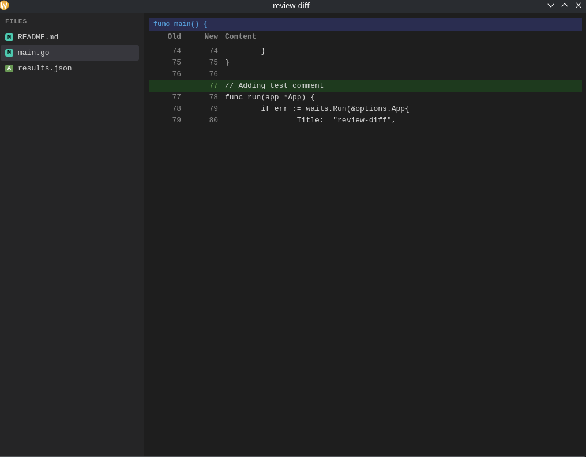
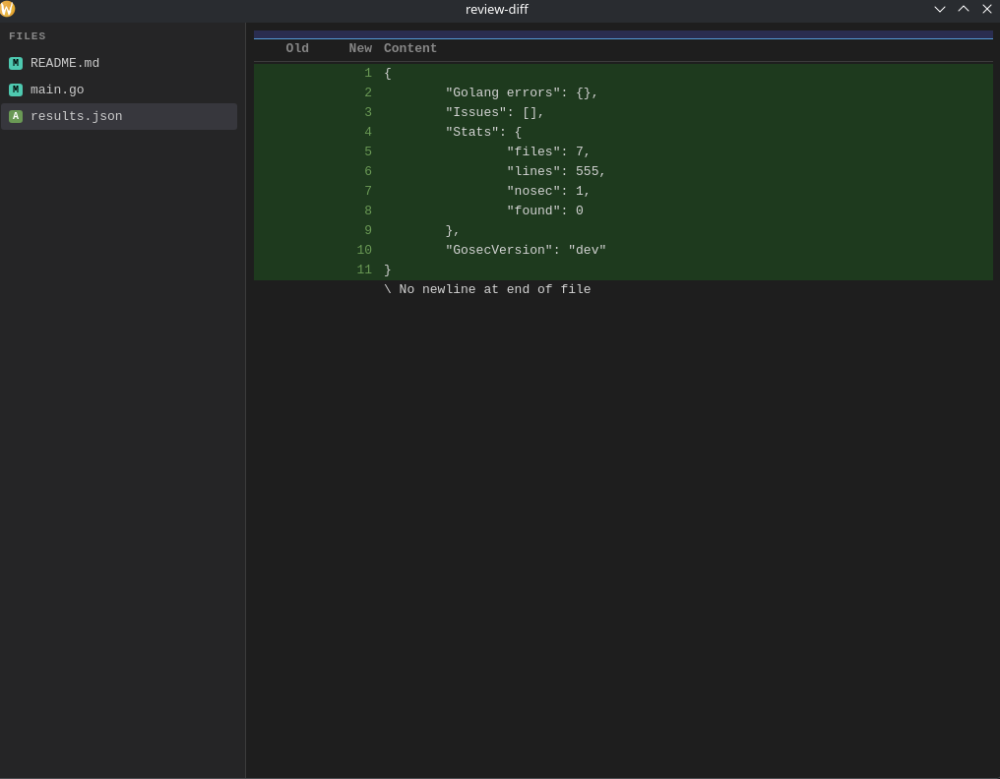
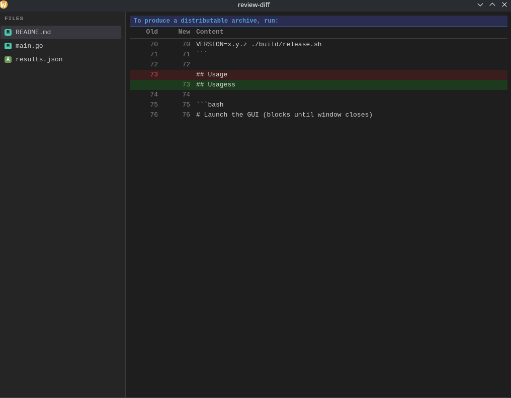

<picture>
  <source media="(prefers-color-scheme: dark)" srcset="product_screenshots/product_screenshot_1.png">
  
</picture>

<p align="center">
  <a href="#features">Features</a> •
  <a href="#screenshots">Screenshots</a> •
  <a href="#install">Install</a> •
  <a href="#usage">Usage</a> •
  <a href="#keyboard">Keyboard</a> •
  <a href="#building">Build</a> •
  <a href="#versioning--releasing">Releases</a>
</p>

<p align="center">
  
  
  
  
  
</p>

**review-diff** is a fast, lightweight desktop application for reviewing diffs between local Git branches, worktrees, and remote-tracking refs. It combines the speed of a native GUI with the convenience of a CLI — run a single command and get a side-by-side diff viewer with keyboard navigation.

---

## Features

- **Fast native GUI** — built with Go + Wails + Svelte, no Electron overhead
- **Side-by-side diffs** — old (left) and new (right) columns with add/remove highlighting and line numbers
- **Lazy loading** — patches load on demand per file; large branches stay snappy
- **Three-dot diff by default** — `base...head` merge-base semantics (PR-style)
- **Worktree support** — compare two linked git worktrees directly
- **Remote-tracking refs** — pass `origin/main` without network calls
- **Full keyboard navigation** — never touch the mouse
- **System theme aware** — follows your macOS / Linux light / dark preference
- **Renames & deletes** — clearly called out in the file list
- **Binary files** — shown as stubs instead of broken panes

## Screenshots

| Overview | Side-by-side diff | File list |
|:--------:|:-----------------:|:---------:|
|  |  |  |

## Requirements

| Runtime | Minimum version |
|---------|----------------|
| **Git** | 2.30+ (must be on `PATH`) |
| **Go**  | 1.23+ (to build from source) |
| **Node.js** | 20+ (to build from source) |
| **Wails CLI** | v2 (`go install github.com/wailsapp/wails/v2/cmd/wails@latest`) |

## Install

### macOS — download the release `.app`

```bash
# 1. Download review-diff-<version>-darwin-amd64.zip from the
#    releases page: https://github.com/dhannanjay/git-review-system/releases

# 2. Unzip and move to Applications
unzip review-diff-*-darwin-amd64.zip
sudo mv review-diff.app /Applications/

# 3. Launch
open /Applications/review-diff.app
```

### macOS — via Homebrew (coming soon)

### Linux — release tarball

```bash
# 1. Download review-diff-<version>-linux-amd64.tar.gz from
#    https://github.com/dhannanjay/git-review-system/releases

# 2. Extract and install
tar xzf review-diff-*-linux-amd64.tar.gz
sudo mv review-diff /usr/local/bin/

# 3. Launch from anywhere
review-diff --help
```

### Arch Linux — AUR / PKGBUILD

```bash
git clone https://github.com/dhannanjay/git-review-system
cd git-review-system
makepkg -fi
```

> The included [`PKGBUILD`](PKGBUILD) wraps the official Linux release tarball. See the file for version bump instructions.

## Build from source

```bash
# Install Wails CLI
go install github.com/wailsapp/wails/v2/cmd/wails@latest

# Development mode (hot-reload frontend)
wails dev

# Production build
wails build

# Run tests
go test ./...
```

The compiled binary goes to `build/bin/`. Build a distributable archive:

```bash
VERSION=x.y.z ./build/release.sh
```

## Usage

### Basic branch comparison

Compare a feature branch against `main` with three-dot (merge-base) semantics:

```bash
review-diff -C /path/to/repo --base main --head feature-branch
```

### Remote-tracking refs

No network call — works with your last `git fetch`:

```bash
review-diff -C /path/to/repo --base origin/main --head origin/feature-branch
```

### Compare two worktrees

Resolves `HEAD` for each worktree automatically:

```bash
review-diff -C /path/to/main-repo \
  --base-worktree /path/to/worktree-a \
  --head-worktree /path/to/worktree-b
```

### Override refs in worktree mode

```bash
review-diff -C /path/to/repo \
  --base-worktree /path/to/wt-a --base main \
  --head-worktree /path/to/wt-b --head feature
```

### Fetch before diff

```bash
review-diff -C /path/to/repo --base origin/main --head feature --fetch
```

## Keyboard

| Key | Action |
|-----|--------|
| `j` / `]` | Next file |
| `k` / `[` | Previous file |
| `n` | Next hunk |
| `p` | Previous hunk |
| `q` | Quit |

---

## Versioning & Releasing

This project follows [Semantic Versioning](https://semver.org/). Releases are published as **GitHub Releases** with platform-specific archives.

### Release workflow

1. **Bump the version** — update `pkgver` in [`PKGBUILD`](PKGBUILD) and the `VERSION` default in [`build/release.sh`](build/release.sh).

2. **Build and package**:

   ```bash
   VERSION=1.2.3 ./build/release.sh
   ```

   Output (varies by platform):
   - macOS: `build/release/review-diff-1.2.3-darwin-amd64.zip`
   - Linux: `build/release/review-diff-1.2.3-linux-amd64.tar.gz`

3. **Create a GitHub release**:

   ```bash
   # Tag the release
   git tag -a v1.2.3 -m "v1.2.3"
   git push origin v1.2.3

   # Create release with assets
   gh release create v1.2.3 \
     --title "v1.2.3" \
     --notes "Release notes go here" \
     build/release/review-diff-1.2.3-*
   ```

4. **Update PKGBUILD checksums** (Arch Linux):

   ```bash
   # After publishing the release
   updpkgsums PKGBUILD
   # Commit the updated PKGBUILD
   ```

### Current version

**v0.1.0** — initial release.

---

## Project structure

```
review-diff/
├── app.go              # Wails app entrypoint & bindings
├── main.go             # CLI flag parsing & session setup
├── main_test.go        # Integration tests
├── changelist/         # File change list (name-status)
├── diffparser/         # Unified diff → structured hunks
├── frontend/           # Svelte + TypeScript UI
│   ├── src/            # Components, stores, styles
│   └── dist/           # Built frontend assets
├── gitrunner/          # Git subprocess runner
├── patchloader/        # Lazy patch loading per file
├── session/            # Review session (refs, worktrees)
├── product_screenshots/# App screenshots for README
├── build/              # Build scripts & output
│   ├── release.sh      # Archive packaging script
│   └── bin/            # Compiled binary / .app
├── PKGBUILD            # Arch Linux package definition
└── wails.json          # Wails project config
```

## License

MIT © [Dhannanjay Raje Vaid](https://github.com/dhannanjay). See [LICENSE](LICENSE).
